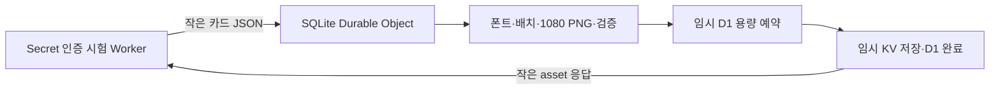

# Durable Objects 무료 PNG 전체 경로 실측

검증일: 2026-10-03 / Asia/Seoul. 브랜치 `codex/ai-card-automation`, 기반 `ad875e8`.

**1080×1080 카드 JSON → 글자 준비·배치 → PNG 생성·검증 → D1/KV 저장 → 이미지 회수 경로를 실제 Workers Free 계정에서 20장 검증했다. 이미지 경로의 CPU 기준은 통과했다.** 일반 Worker의 10ms에 맞추는 데 막혔던 이미지 계산을 SQLite Durable Object(DO)로 옮겼다. AI 생성·교차 검토·자동 예약·운영 배포는 아직 완료하지 않았다.

## 실제 결과

| 측정 대상                       | 표본 |   최소~최대 |    중앙값 |
| ------------------------------- | ---: | ----------: | --------: |
| DO 전체 생성·저장 CPU           | 20회 |    78~474ms |     133ms |
| 각 DO의 첫 PNG CPU              |  4회 |   252~474ms |   439.5ms |
| 같은 DO의 후속 PNG CPU          | 16회 |    78~187ms |     117ms |
| 일반 Worker의 생성 요청 CPU     | 20회 |       0~1ms |       0ms |
| 일반 Worker 요청 전체 경과 시간 | 20회 | 996~2,273ms | 1,212.5ms |

CPU는 Cloudflare tail의 `cpuTime`, 경과 시간은 `wallTime`이다. 응답 안 `timings_ms`는 CPU가 아니며, Worker 시계는 I/O 사이 계산 시간을 0으로 표시할 수 있으므로 구간별 CPU 판단에 사용하지 않는다. 표의 0ms도 제공사의 기록 단위이며 계산량이 전혀 없다는 뜻이 아니다.

5종 입력(표현형·비교형·긴 표현형·긴 비교형·한글/기호 범위)을 4개의 DO에서 각각 생성했다. 네 번은 해당 DO에서 폰트를 처음 준비하는 생성이며, 런타임 프로세스 전체를 매번 새로 시작하도록 통제한 콜드 스타트 시험은 아니다. 측정 전 잘못된 입력 1회로 DO 3과 수집 연결을 확인했다. 생성 예제를 미리 SVG로 저장하지 않고 요청 JSON으로 배치와 SVG를 계산한다. 빌드에서 준비한 것은 예제 전용이 아닌 기존 라이선스 폰트 전체 124개, 7,675,800바이트다.

- **20/20 PNG**가 로컬 SVG/Resvg 기준과 전체 바이트·SHA256이 같았다. 모든 출력은 1080×1080, 41,592~73,690바이트이며 총 1,213,920바이트다. 표현형과 긴 비교형 실제 PNG를 육안으로 확인했다. 휴대전화·카카오에서 이번 PNG를 확인한 것은 아니다.
- 원격 D1: 카드 20개, `ready` asset 20개, 예약·발송 0개, 외래키 오류 0개. 업로드 횟수 20, 저장량 1,213,920바이트. 원격 KV의 키 20개가 asset ID와 모두 일치했다.
- 같은 job 재호출은 같은 asset을 반환했고 저장 수량은 증가하지 않았다. 내용이 다른 같은 job은 409, 잘못된 슬롯은 404, 잘못된 입력은 400, 비인증은 401이었다.
- 새 PNG 생성은 **20회/이번 상한 40회**, HTTP 요청은 46회였다. 과거 일반 Worker 시험 누적 88장과 합하면 원격 PNG 누적 108장이다. 과거 실패 결과를 이번 성공으로 다시 분류하지 않는다.

### 로그 완전성의 범위

새 이미지 생성 20회와 회수 20회 각각에 일반 Worker·DO 로그가 있어 **이미지 경로 80/80개**를 대조했다. 이 20장의 CPU 적합성과 이미지·저장 결과를 확인할 수 있다.

오류·재사용 검증까지 포함한 전체 예상 로그는 90개 중 89개다. `do-call-044`의 **409 충돌 거부 응답에 대한 일반 Worker CPU 로그 한 개**가 없다. HTTP 409 응답과 해당 DO 로그는 확보했다. 누락 원인은 미확정이며 해당 CPU를 0 또는 통과로 채우지 않는다. 따라서 전체 시험 로그 완전성은 미완료다. 파서 오류·버퍼 폐기·종료 잔여 버퍼는 모두 0이다.

[원장·응답·CPU·소스 해시·정리 증거](evidence/AI_PNG_DURABLE_2026-10-03.json)에 모두 보존했다. `summary.image_path_cpu_pass=true`와 `summary.all_trial_events_complete=false`를 구별한다. raw `run.cpu_qualified=false`는 수집 종료 당시 미대조 상태이며 최종 판단은 원장을 대조한 `summary`다.

CPU 로그의 배포 버전은 renderer `b41a4a9a-f7e0-4ea6-ab01-230be4adf4bc`, Secret 설정 후 입구 `ad17f2ab-d969-40b7-b7d1-ccc912353fa7`로 고정 검증한다. 소스 해시 10개는 보고서 작성 시점 파일의 스냅샷이며 업로드된 번들의 별도 서명 증거는 아니다. 최초 렌더 분류도 원장 순서와 슬롯별 입력 순서에 맞는지 검증한다.

## 구현 구조와 무료 조건



일반 Worker는 인증과 전달만 수행한다. DO가 PNG 바이트 검증과 저장까지 담당해 계산을 호출 Worker에 돌려주지 않는다. 기존 `saveCard`·`uploadImage`와 D1 용량 예약·실패 정리를 재사용했다. DO의 영속적인 시도 횟수와 작업 기록으로 같은 작업의 중복 생성을 막는다. 준비/배치/렌더/카드 저장/이미지 저장/완료 기록 중 실패 지점을 기록하고 중단된 작업은 자동 재생성하지 않는다.

공식 기준은 일반 Worker Free CPU 10ms와 DO 기본 CPU 30초를 각각 적용한다. Free에서는 SQLite 기반 DO를 사용하며 요청 100,000회/일, 실행량 13,000GB-s/일이 포함된다. CPU와 GB-s는 다른 지표다. [Worker 제한](https://developers.cloudflare.com/workers/platform/limits/), [DO 제한](https://developers.cloudflare.com/durable-objects/platform/limits/), [DO 요금](https://developers.cloudflare.com/durable-objects/platform/pricing/)

18:49:45 KST에 계정의 **Workers Free·US$0·현재 요금제**, 시험 전 DO 사용량 0과 D1/KV 잔여 범위를 확인했다. 정리 후 DO Dashboard는 요청 44회, 실행량 3.19GB-s, SQL 읽기 38·쓰기 60을 표시했다. 제공사 화면 집계는 지연될 수 있다. 한 장 474ms는 이번 표본 최대값이며 보장 상한이 아니다. 메모리 최대 사용량 수치는 확보하지 않았고, 이번 20회에서 메모리 초과 오류가 없었다는 것만 확인했다.

사용자의 진행 지시에 따른 격리 실험 예외를 `AGENTS.md`에 명시하고 별도 `check-automation-durable-free.mjs`를 추가했다. 운영 `check:free`의 기존 허용 목록은 유지한다. DO 실험 설정 검사는 실제 계정 요금 확인을 대체하지 않는다.

## 검증과 리뷰

- 로컬 workerd의 실제 DO·D1·KV: 5 PNG 동일성, 새 내용·번호 반영, 동시 중복, 잘못된 입력, 10회 상한의 DO 재시작 후 유지, 폰트 실패, KV 성공 뒤 D1 실패, 이미지 저장 성공 뒤 DO 완료 기록 실패를 검증했다.
- 무료 구성 검사: legacy DO, 공개 renderer, 운영 DB 이름, 외부 서비스, AI 바인딩, Cron, 다른 DO 대상, 일반 변수에 Secret 추가를 거부한다.
- 증거 검사: 생성·회수 로그 누락, CPU 초과, 중복 로그·asset, 실패 응답, 빈 증거를 합격으로 처리하지 않는다.
- 전용 검증은 DO 동작 8개·무료 구성 9개·증거 판정 12개, **총 29개**다. 증거 판정에는 다른 배포 버전과 최초 렌더 표시 바꾸기 거부도 포함한다.
- `npm run build`의 타입·Vite·운영 Worker 2개 dry-run, `npm run check:free`, 두 시험 Worker dry-run을 통과했다. 전체 기존 Vitest·E2E는 이번에 다시 실행하지 않았다.
- 요청한 [review 스킬](C:/Users/user/.agents/skills/gstack/review/SKILL.md)의 구조·보안·성능·테스트·유지보수·데이터/API·독립 검토를 적용했다. 내용/번호 검증 분리, 저장 후 완료 기록 실패 검증, 실패 단계 기록을 보완했다. 별도 모델 또는 Codex CLI gate 통과로 표시하지 않는다.

원격 D1 마이그레이션은 기존 Wrangler Windows SQL 파싱 문제로 0006에서 중단됐다. 부분 적용이 없음을 조회한 후 기존 0006~0013 SQL을 파일로 실행해 13개 적용과 외래키를 확인했다. 운영 DB는 변경하지 않았다. 수집기는 JSON 모드에 연결 배너가 없다는 점을 수정했으며 최초 실패는 요청 0·생성 0으로 별도 보존했다.

## 정리와 남은 구현

시험 Worker `en-card-png-do-probe`와 `en-card-png-do-trial`, Secret, SQLite DO 클래스와 상태, 임시 D1·KV를 모두 삭제했다. 클래스는 공식 `deleted_classes` 마이그레이션을 적용한 뒤 Worker를 지웠다. 로컬 시험 토큰도 제거했다. Dashboard에서 DO 없음·기존 Worker 3개를 확인했고 D1·KV 목록에는 기존 운영 자원만 남았다. [DO 삭제 절차](https://developers.cloudflare.com/durable-objects/reference/durable-object-class-migrations-legacy/)

**다음 구현은 이 경로의 제품 편입과 AI 작성·독립 검토·자동 예약 연결이다.** 영속 job ID/revision, 제작 마감, 취소·설정 변경 경합, 중단된 업로드의 복구를 실제 자동화 상태와 연결해야 한다. 이번 `blockConcurrencyWhile` 직렬화는 30초 경과 제한을 가진 시험용이며, 운영 복구 상태 머신을 대신하지 않는다. Free AI 계정 조건과 공유 호출량, 전체 자동화의 CPU, PC 종료 후 신규 제작·수신은 별도 검증 대상이다. 새 비밀값은 이번 단계에 필요하지 않았다.

로컬 재현:

```sh
npm run bench:automation:durable:prepare
npm run check:automation:durable:free
npm run test:automation:durable
npm run bench:automation:durable:dry-run
npm run bench:automation:durable:probe:dry-run
```

원격 설정은 삭제한 시험 자원을 가리키므로 그대로 재실행하지 않는다. 재시험 시 새 격리 D1/KV·SQLite DO와 시험 Secret을 준비하고 계정 Free·사용량·시도 상한을 확인한다. `node scripts/run-automation-durable-remote.mjs`는 사전 원장을 독점 생성해 기존 측정을 덮어쓰지 않는다. 로컬 원자료가 남아 있으면 `node scripts/report-automation-durable.mjs`로 PNG·D1/KV·CPU 원장을 다시 대조할 수 있다. 저장된 증거 회귀 검증은 원격 자원 없이 실행된다.
