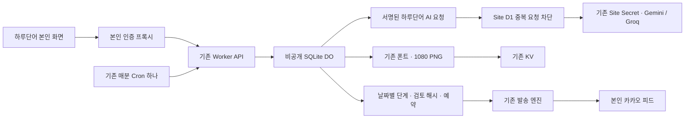

# AI 카드 자동 제작 제품 연결 — 2026-10-03

**최신 상태 — 2026-10-06:** 수정 제공자 대체 `c503210`을 기존0018 호환 자동화 DO에 반영했다. 현재 정규 설정은version22·매일07:30·5장·활성이며10월7일 실행을 검증한다. 아래 날짜별 비활성/이전 버전은 당시 이력이다. 현재 신규 설치는0001~0018 전체 이력을 요구하며 [설정 절차](SETUP.md)와 [최신 검증·복구](VERIFICATION.md)를 우선한다.

**현재 연결 — 2026-10-05 22:41 KST:** 중복 재생성 EN_Card `ad2e125`·하루단어 `40a4671`을 D1 0018·호환 Worker/DO·기존 Site v119에 반영했다. 중복이면 같은 자리에서 다른 후보를 작성·독립 검토하며 중복3회와 기존 호출/마감 상한을 유지한다. 5장 시험은 최소45분이다. 기존 데이터·바인딩·Site 환경59/공개정책4를 보존하고 공개 파일/비인증401을 확인했다. 정규 자동 제작은 비활성, 새 AI/카카오 호출0이며 실제 재생성 CPU·새5장 수신은 별도 미완료다. [현재 규칙](AI_CARD_AUTOMATION_QUANTITY.md), [배포 근거](VERIFICATION.md)를 따른다. 아래는 각 이전 시점 기록이다.

**2026-10-04 16:19 KST review 수정본 커밋·운영 반영:** `e088d61`을 커밋하고 DO→발송→주 Worker 및 하루단어 Site v113(소스 `22c2da2`)에 반영했다. 실제 live 설정의 세 Worker dry-run/무료 구성, Site 연동15개·타입·빌드, 공개 PNG/원본200·동일 해시·비인증 자동화401을 확인했다. 운영14개 주요 테이블의 행 수·해시, Secret 이름/바인딩/Cron, Site 공개 범위·환경 revision59를 보존했다. 화면도 **실행 중·10월5일07:00 제작·08:00 발송·당일 종료**를 확인했다. 추가 AI/카카오 시도·새 자원·마이그레이션0이다. 무료 계정 확인은 기존 기록을 유지하며 오늘 구독 API403·웹 로그인 만료로 재확인하지 못했다. 이 단계에서 새 코드의 실제 제작/발송 CPU나 내일 수신은 검증하지 않았다. [배포·보존 근거](evidence/AI_AUTOMATION_REVIEW_DEPLOY_2026-10-04.json). 아래 기록은 각 시점의 상태다.

**2026-10-04 14:56 KST 다음 자동 제작 활성화:** 사용자 요청에 따라 저장된 영화 대사·초급·표현형·10월5일 하루 설정을 그대로 시작했다. 화면의 실행 중/다음 시각과 D1 enabled1·version6을 확인했다. **2026-10-05 07:00 KST부터 제작, 08:00 KST 발송 예정**이며 종료일은10월5일이다. 추가 AI/발송은 아직0회, 코드/배포 변경은 없다. 다음 제작·수신은 미래 작업으로 미실행이다. [활성화 근거](evidence/AI_AUTOMATION_NEXT_2026-10-05.json). 아래 비활성 표시는 이전 시점 상태다.

**2026-10-04 14:48 KST 남은 실제 토큰 갱신 검증 완료:** 기존 비공개 DO에서 카카오 토큰을 실제 갱신했고 version12→13·연결 정상·오류/잠금0을 확인했다. CPU는 실제 운영 갱신 DO **6.054ms**, 별도 검증용 주 Worker **2.250ms**다. 검증용 수치는 정상 예약 엔진 전체 갱신 회차의 CPU가 아니다. 기존 운영 버전/바인딩/Secret 이름/Cron을 복원·대조하고 인증 외18개 테이블의 행 수·해시를 보존했다. 추가 AI·카카오 메시지0회, 신규 유료 구성0개다. 관련59검증·타입·dry-run·무료 구성·review 후속 검증을 통과했다. 현재 자동 제작은 비활성이며 아래 미검증 표시는 각 이전 시점 기록이다. [실제 갱신·CPU·복원 근거](evidence/AI_TOKEN_REFRESH_VERIFICATION_2026-10-04.json).

**2026-10-04 14:14 KST 무인 제작·수신 확인:** 사용자가 PC·브라우저·Codex 종료 후 새 카드 제작과 휴대전화 이미지·원본 링크 확인 요청에 “정상 통과했다.”고 응답했다. 사용자 수행 확인으로 기록하며 기기 종료나 휴대전화를 에이전트가 직접 관찰한 것은 아니다. 서버에서 Gemini 작성13:46:20.914 → Groq 검토13:47:20.939 → 1080 PNG13:48:21.785 → 예약13:50:36.557 → live 발송1회·접수14:01:12.578을 대조했다. 카드 `What happens next?`, AI2회·재시도0·PNG64,621바이트이며14:01:38.362에 자동 종료됐다. 활성예약/미해결/FK0, 기존 기록·저장된 일일 설정·배포/Secret/무료 구성은 보존됐다. 다음 자동 제작은 비활성이다. 실제 발송 CPU는 주 Worker4.269ms·발송 Worker3.787ms·유효 토큰 DO RPC3.487ms, DO 이미지 생성404.606ms다. 이번 관측 구간 일반 Worker 표본은10ms 미만이지만 미래 최댓값 보장은 아니다. **새 RPC의 실제 토큰 갱신 CPU만 별도 미검증**이며 credential version12가 유지되어 이번에는 갱신이 없었다. [사용자·서버·CPU 근거](evidence/AI_AUTOMATION_TRIAL_2026-10-04.json). 아래 기록은 이전 시점 상태다.

**2026-10-04 추가 한 장 시험 등록:** 사용자의 오늘 새 카드 시험 요청에 따라 기존 하루 한 장과 별도인 KST 하루 한 번 시험을 구현·배포했다. 기존 데이터 보존·암호화 백업·0015·DO/주 Worker·Site v112 적용을 확인했다. 저장된 일일 설정은 유지하며 시험만 영화 대사/초급/표현형으로 2026-10-04 13:46 KST 제작 시작, 2026-10-04 14:01 KST 발송 예정이다. 새 run은 draft·내용 null·AI 시도0이며 미래 일일 제작 next_due_at=null이다. 기존 카드15·이미지6·정규 AI1건·발송 이력은 그대로다. 제품35·런타임/구성44·Site15·브라우저2개와 타입/빌드/무료구성/review를 통과했다. 실제 새 AI/카카오 호출과 PC 종료 검증은 아직 완료가 아니다. [등록·보존 근거](evidence/AI_AUTOMATION_TRIAL_2026-10-04.json). 아래 기록은 이전 시점 상태다.

## 인증 CPU 보완 — 2026-10-04

아래 원인 분석과 최초 배포 설명은 당시 기록이다. 실제 갱신 후속 검증은 14:48 KST에 완료했고, 갱신 DO6.054ms·검증용 주 Worker2.250ms 및 복원 근거는 문서 상단을 따른다. 검증용 주 Worker 수치는 정상 예약 엔진 전체 갱신 회차의 CPU가 아니다.

10:45 토큰 갱신이 발생한 주 Worker 실행의 사후 GraphQL CPU가 **14.004ms**였다. 응답은 success이고 사용자 수신도 정상이었지만 일반 Worker 10ms 적합성은 통과로 판단하지 않는다. 다음 10:46 발송 tick은 4.776ms였다. 이 값은 Cloudflare의 시각·버전별 집계이며 제공사 호출 대기 시간이 아니다.

예약 중 토큰 조회·갱신은 기존 비공개 `CardAutomation`의 `credentials` 인스턴스 RPC로 분리했다. 기존 `accessToken`의 D1 잠금·버전·재시도·불명 처리와 갱신 후 다음 Cron 발송 규칙을 재사용한다. 세 인증 설정은 호출 중에만 전달하며 DO 필드·storage·로그·공개 HTTP에 저장/노출하지 않는다. RPC 응답 유실 시 로컬 재갱신하지 않고 다음 실행에서 D1 상태를 확인한다. 바인딩이 없는 기존 설치만 종전 경로를 사용하며 해당 경로의 CPU 개선을 주장하지 않는다.

배포는 **RPC 메서드가 있는 DO → 주 Worker** 순서다. DO `SEND_MODE`는 주 Worker와 일치해야 한다. 주 Worker가 live이고 AI만 중지할 때는 DO `SEND_MODE=live`, `AUTOMATION_MODE=off`, `AI_FREE_CONFIRMED=unconfirmed`를 사용한다. DO를 dry_run으로 바꾸면 기존 수동 예약의 인증 처리도 중지된다. 계정·Secret·D1 스키마 추가는 없다. 139개 관련 로컬 테스트·타입·전체 빌드·기본/운영 무료 구성 검사를 통과했으며 **배포 후 실제 갱신 CPU 재측정은 별도 미완료 항목**이다.

**2026-10-04 10:53 KST 수신 확인:** 사용자가 PC·브라우저·Codex 종료 상태의휴대전화 이미지/원본 링크 정상 동작을 확인했다. 서버에는live발송1회·sent(10:46:26.900 KST)가 기록됐고 자동화는10:47:25에complete로 자동 종료됐다. 활성예약0·미해결0·FK0, 무료구성·배포버전유지다. 승인된1장 시험은종료했다. PC 종료부터의새AI제작 및 이번 발송CPU는 별도 미검증으로 남긴다. [검증 기록](VERIFICATION.md), [서버·사용자 확인 근거](evidence/AI_AUTOMATION_LIVE_2026-10-04.json). 아래 발송 전 표시는 당시 기록이다.

**2026-10-04 09:54 KST 실제 검증:** 사용자가 승인한1장에 대해 Gemini 작성→Groq 교차 검토→1080 PNG→기존1회 예약까지 실제 클라우드 실행을 확인했다. 표현은`How's it going?`, AI호출2회·이미지48,869바이트·수정/재시도0이다. 제작4단계 일반 Worker CPU각2ms, DO11/7/505/4ms의8로그를 모두 확보했다. 발송은오늘10:45 KST이고 자동화 종료일도오늘로 제한했다. 카카오 접수·휴대전화/PC종료 수신·PC종료 상태 새 제작은 미검증이다. 현재 제품 재배포는 필요 없다. [실측 근거](evidence/AI_AUTOMATION_LIVE_2026-10-04.json), [단계별 기록](VERIFICATION.md). 아래 비활성·승인 대기는 이전 시점 기록이다.

상태: 제품 코드·로컬 통합 검증·리뷰 수정 및 EN_Card 서버 비활성 배포 완료. Site v111 게시까지 완료했고 실제 AI 호출·PC 종료 수신 확인은 남았다. 앞선 임시 SQLite DO Free 시험 20장과 이번 제품 검증을 합산하지 않는다. 두 저장소의 브랜치는 `codex/ai-card-automation`이다.

**2026-10-04 02:54 KST:** 사용자 확인으로 Site의 두 키가 검증한 무료 계정 소속임을 확정했다. 운영 DO만 `9b97ba69-b7f3-4bb5-bcc4-251b86956e7f`, live/live/google_groq_free로 반영했으며 signed status `available:true`를 확인했다. **서버는 시작 가능하지만 사용자 자동화는 아직 시작하지 않았다.** 설정/작업/시도/표현 테이블0행, 실제 AI/카카오0회다. 첫 본인 시험1장 범위는 선택 대기이며, 아래 off 설정의 배포 기록은 이전 시점이다. 기본 저장소 설정은 계속 비활성이다.

**22:15 KST 후속:** Site v111 (`d6b8f6654e1edce872c1134abe60b34a927e15ac`) 게시와 DO `33eaf35a-75c8-4131-b818-1037ebc9bc85` 비활성 반영을 완료했다. 사이트 키 설정·서명·nonce 읽기 상태가 실제로 확인됐다. 운영 전 점검에서 발견한 Workers의 `redirect: 'error'` 거부를 `manual`+3xx 거부로 수정했다. [Cloudflare Request 문서](https://developers.cloudflare.com/workers/runtime-apis/request/)에는 error 값도 나열되지만 현재 프로젝트의 실제 workerd에서는 거부되어, 문서와 실행 결과의 차이를 로컬 재현·운영 성공으로 판단했다. 실제 Workers fetch를 포함한48테스트 및 하루단어23테스트·타입/빌드·독립 리뷰를 통과했다. 상태 성공은 AI 키의 유효성이나 무료 프로젝트 소속 확인을 대신하지 않는다. 무료 소속 질문은 답변 대기이고 자동 제작/AI/카카오 호출은 여전히 꺼져 있다.

## 사용 흐름

하루단어 카드 작업실의 **카드 만들기 → AI 카드 자동 제작**에서 주제·기준 표현·난이도·카드 종류·시작일·종료일·KST 발송 시각을 저장한다. 카카오 연결과 무료 실행 설정이 준비되면 **자동 제작 시작**을 누른다. 발송 1시간 전에 제작을 시작하고 5분 전까지 예약을 준비한다. 시작 시 1시간을 확보하지 못하면 다음 가능한 날짜를 선택한다.

- 매일1~5장: Gemini 작성 → Groq 검토 → 1080×1080 PNG → 카드별 한 장짜리 예약.
- Gemini 초안의 일시 장애/잘못된 응답은 다음 Cron에서 최대 3회 확인한 뒤 Groq 작성·Gemini 검토로 역할을 바꾼다. 두 제공사 모두 참여해야 예약할 수 있다.
- 내용 검토 실패는 작성 모델이 한 번 수정하고 다른 모델이 재검토한다. 수정 제공자의 시도3회를 소진하면 반대 제공자의 남은 수정 예산으로 전환하고, 수정 결과를 다른 제공자가 새로 검토한다. 두 번째 검토 실패·분량 초과는 해당 카드를 건너뛴다. 운영0018은 중복을 같은 자리에서 재작성·독립 검토하고 중복3회 또는 기존 호출/마감 한도에 도달하면 종료한다. [수량·중복 재생성 규칙과 시험 제작창 한계](AI_CARD_AUTOMATION_QUANTITY.md)를 따른다.
- 인증·무료 한도·설정·저장 실패는 자동 제작을 중단한다. 무료 확인 값은 청구 차단 장치가 아니며 실제 계정 확인이 필요하다.
- 설정 저장과 일시정지는 처리 중인 제작 및 대기 중인 자동 예약을 취소한다. 이미 전송된 메시지는 회수하지 않는다. 재개는 **자동 제작 시작**으로 다음 가능한 날짜부터 한다. 같은 KST 날짜의 작업을 다시 만들지 않는다.
- 최근 30일 작업에서 수정본·작성/검토 제공사·검토 결과·발송 상태·원본·PNG 다운로드·최신 카드 편집을 확인한다. AI 검토와 사람 검토는 보관함에서 구별한다.
- 자동 예약의 날짜·카드를 수동 변경하려면 새 예약을 만든다. 자동 예약은 개별 일시정지·취소가 가능하다. 카드 원문 편집은 이미 준비된 예약의 불변 이미지/내용을 바꾸지 않는다.

## 구현 위치와 보장 범위

| 위치                                                               | 역할                                                                              |
| ------------------------------------------------------------------ | --------------------------------------------------------------------------------- |
| `src/automation/worker.ts`, `svg.ts`                               | 비공개 SQLite DO, 기존 폰트/줄바꿈, resvg PNG, 메모리 재사용                      |
| `src/automation/providers.ts`, `relay-server.ts`                   | 기존 하루단어 서버의 Secret으로 고정 제공사·모델 호출, 25초/64KiB 제한            |
| `src/shared/automation-relay.ts`, `relay-client.ts`                | 별도 용도로 파생한 HMAC 서명, 60초 유효 시간, 상태 조회 5초                       |
| `src/automation/engine.ts`, `settings.ts`                          | 날짜별 단계, 최대 3회 내구 시도 기록, 120초 claim, 버전·수정본 해시, 중단·복구    |
| `migrations/0014_card_automation.sql`, `0015_automation_trial.sql` | 설정/작업/시도/표현 중복, AI 검토 출처, 정규/시험 중복 키, 저장·발송 보호         |
| `src/worker/automation.ts`                                         | 본인 인증 후 4KiB 설정 전달, 기존 Cron에서 DO 호출. 주 Worker dry_run은 호출 차단 |
| `src/web/AutomationPanel.tsx`                                      | 설정·시작·일시정지·기록·결과 화면                                                 |
| 하루단어 `lib/server/card-studio.ts`                               | 기존 본인 인증·Origin 확인을 유지하는 API 프록시                                  |



일반 Worker에 fontkit/resvg를 넣지 않는다. DO 안에서 AI 결과·폰트·PNG를 처리하며 D1을 작업 상태의 기준으로 쓴다. AI API 키는 기존 하루단어 Site의 `google_api`, `groq_api`에만 두고 추출하거나 DO로 복사하지 않는다. 주 Worker는 기존 본인 ID·브리지 Secret으로 용도를 구분한 서명 키를 파생해 비공개 DO 바인딩에만 전달한다. Site는 고정 경로·서명·시각·입력 스키마를 검증하고 D1의 nonce를 한 번만 소비한 뒤 AI를 호출한다. 본문 읽기는 5초·64KiB, 서명은 60초, nonce 보존은 서명 시각 이후 5분이다. 상태 조회는 AI 호출·DB 쓰기 없이 키 설정과 nonce 테이블 읽기 가능 여부를 확인한다.

DO의 메모리는 최적화일 뿐 영속 작업 기록을 대신하지 않는다. 설정 변경 뒤 도착한 응답과 만료된 claim의 오류는 새 작업이나 복구된 예약을 덮어쓰지 않는다. 같은 작업은 고정 카드/asset/예약 ID를 사용하며 KV put 결과가 불명확해도 저장량을 임의 반환하지 않는다. 정리 뒤 늦게 도착한 put은 용량을 복원한 뒤 보상 정리한다.

이미지 준비 뒤 최소 2분을 기다려 예약을 등록한다. 이전 자동 발송이 `sending` 또는 미해결 `unknown`이면 새 자동 예약/실제 호출을 차단한다. 카카오의 외부 접수와 D1을 하나의 트랜잭션으로 묶거나 정확히 한 번 도착을 보장하지 않는다.

## 로컬 검증 명령

```sh
npm run build
npm run check:free
npx vitest run tests/automation-product.test.ts tests/automation-product-do.test.mjs tests/automation-relay.test.ts tests/free-config.test.ts
npm run test:e2e -- --project=chromium
npm run test:e2e -- --grep "AI 자동 제작"
node scripts/export-haru.mjs --target "C:/Users/user/Documents/ChatGPT/하루단어"
```

제품 DO 통합 테스트는 실제 로컬 SQLite D1/KV·패키징된 124개 폰트·Wasm으로 PNG를 만든다. AI 응답은 고정 모의 응답이며 제공사·카카오 호출을 하지 않는다. 브라우저 검증은 로컬 모의 계정·설정으로 수행한다. 원격 CPU 결과를 로컬 경과 시간으로 대체하지 않는다.

2026-10-03 전체 Vitest 35파일497개가 통과했다. 이후 리뷰 수정의 영향 범위를 3파일41개로 다시 검증하고 마지막 자동 예약 수정 보호는 선택한 회귀 1개로 확인했다. 서로 중복되므로 합산하지 않는다. 전체 Chromium38개, 자동화 흐름의 Chromium/WebKit2개, 하루단어 전체 테스트·타입·빌드가 통과했다. 자세한 시점과 범위는 [검증 기록](VERIFICATION.md#ai-자동-제작-제품-연결--2026-10-03)에 있다.

## 운영 적용 순서

1. 현재 기본 주 Worker는 수동 예약 인증에도 DO를 사용하므로 **AI를 쓰지 않아도 비공개 SQLite DO가 필요하다.** Workers Free·SQLite DO Free 자격과 공유 한도를 확인한다. 주 Worker/DO의 D1·KV·APP_ORIGIN·SEND_MODE를 일치시키고 발송 Worker도 같은 D1·APP_ORIGIN을 사용한다. `wrangler.automation.deploy.jsonc`는 dry_run/off/unconfirmed, `wrangler.automation.live.jsonc`는 수동 live 운영이면 live/off/unconfirmed로 준비한다. 기본 파일은 수정하지 않는다.
2. 폰트 준비·타입/빌드·테스트와 세 실제 설정의 로컬 deploy dry-run/무료 검사를 먼저 완료한다. custom `check:free`에는 해당 DO 파일을 `--automation-config`로 반드시 지정한다. 새 DO의 workers.dev·preview URL은 끄고 SQLite migration만 사용한다. [전체 설정 명령](SETUP.md#원격-실행-절차)을 따른다.
3. 기존 운영의 자동 제작과 활성 예약을 중지하고 진행 중 제작·발송이 없는지 확인한다. 주 Worker의 쓰기/Cron을 차단한 상태에서 암호화 D1 백업·복호화 해시와 현재 이력을 보존한다. 미적용 마이그레이션을 **0018까지** 순서대로 적용하고 기존 행·FK·18개 이력을 대조한다. 기존 run ID·번호/수량·자식 참조와 시도 이력을 보존하며, 이미0018이면 재적용하지 않는다. 다중 카드/시험·중복 거절 기록이 생기면 **0018 호환 코드로만 복귀**한다. 예전 strict 설정 파서는 새 수량을 거부하므로 구버전 DO만 되돌리지 않는다. 새 시험/발송 기록이 생긴 DB에 이전 백업을 덮어쓰거나 immutable run 설정·이력을 재작성하지 않는다. [수량 확장 계약과 복구](AI_CARD_AUTOMATION_QUANTITY.md)를 따른다.
4. **비공개 DO → 비공개 발송 Worker → 주 Worker → 하루단어 Site** 순서로 반영한다. 새 주 Worker를 적용하기 전에 DO 인증 RPC와 cross-script 대상이 존재해야 한다. 쓰기/Cron은 일관된 설정과 데이터 확인 후 복원한다. 수동 운영의 AI는 off/unconfirmed로 유지한다. AI Site 게시에는 `drizzle/0004_card_automation_nonces.sql`과 생성된 서버 번들을 포함한다. Site 마이그레이션이 누락되면 상태 확인이 실패해 시작하지 못한다. 새 시험 입구·추가 Cron은 필요하지 않다.
5. AI를 사용할 때만 기존 Sites Secret `google_api`, `groq_api`의 실제 Google/Groq Free 프로젝트 소속과 공유 한도, `google_ai_enabled=true` 및 키 연결 상태를 확인한다. 키를 조회·복사하거나 DO Secret으로 등록하지 않는다. 별도 DO 설정을 `AUTOMATION_MODE=live`, `AI_FREE_CONFIRMED=google_groq_free`로 바꾸고 `--automation-active`를 추가해 검사한 뒤 배포한다. 주 Worker와 DO의 SEND_MODE는 모두 live여야 한다. 설정 선언은 계정 과금 통제가 아니며 실제 계정 확인을 대신하지 않는다.
6. 허용된 본인 시험 범위에서 화면으로 시작하고 AI 작성·교차 검토·PNG·예약·API 접수·휴대전화 이미지/원본·PC 종료 상태를 각각 확인한다. 일반 Worker CPU는 10ms 기준으로 별도 측정한다. 불확실하거나 한도를 넘으면 자동 제작을 중지하고 운영 완료로 표시하지 않는다.

수동 live 운영의 예시다. 실제 식별자는 로컬 전용 설정에 준비하고 DO의 AI는 off/unconfirmed로 둔다. 아래 로컬 검사가 모두 끝난 뒤에만 위3단계의 유지보수·암호화 백업·마이그레이션을 진행한다.

```sh
npm run build
npm run automation:fonts
npx wrangler deploy --dry-run --config wrangler.automation.live.jsonc --outdir .worker-automation-build
npx wrangler deploy --dry-run --config wrangler.delivery.deploy.jsonc --outdir .worker-delivery-build
npx wrangler deploy --dry-run --config wrangler.live.jsonc --outdir .worker-build
npm run check:free -- --config wrangler.live.jsonc --delivery-config wrangler.delivery.deploy.jsonc --mode live --automation-config wrangler.automation.live.jsonc
```

승인 범위 내에서 유지보수·백업을 확인한 후 실행한다. 신규 설치의 dry_run 단계는 [SETUP](SETUP.md#원격-실행-절차)을 먼저 따른다.

```sh
npx wrangler d1 migrations apply DB --remote --config wrangler.live.jsonc
npx wrangler d1 execute DB --remote --config wrangler.live.jsonc --command "PRAGMA foreign_key_check; SELECT name FROM d1_migrations ORDER BY id;" --json
npx wrangler deploy --config wrangler.automation.live.jsonc
npx wrangler deploy --config wrangler.delivery.deploy.jsonc
npx wrangler deploy --config wrangler.live.jsonc
```

AI 활성 전환은 별도 확인 후 DO 설정만 live/live/google_groq_free로 바꿔 다시 로컬 검사한 뒤 반영한다.

```sh
npx wrangler deploy --dry-run --config wrangler.automation.live.jsonc --outdir .worker-automation-build
npm run check:free -- --config wrangler.live.jsonc --delivery-config wrangler.delivery.deploy.jsonc --mode live --automation-config wrangler.automation.live.jsonc --automation-active
npx wrangler deploy --config wrangler.automation.live.jsonc
```

위 명령은 실행 기록이 아니다. 종료·중단은 화면 일시정지가 우선이다. 긴급 dry_run 복귀는 두 설정을 검사한 뒤 주 Worker부터 dry_run으로 배포해 새 제작/발송을 중단하고 DO도 dry_run/off/unconfirmed로 맞춘다. 이미 시작한 외부 요청의 접수는 취소할 수 없다. DO만 dry_run으로 바꾸면 live 주 Worker의 수동 예약도 인증 대기 후 missed가 될 수 있다. [복구 명령](OPERATIONS.md#비공개-발송-worker-중단복구)을 따른다.

2026-10-03 최초 배포 당시에는 기존 운영 ID를 유지한 Git 제외 `wrangler.automation.live.jsonc`를 **off/dry_run/unconfirmed**로 준비했다. 이는 인증 RPC 추가 이전 기록이며 현재 도입 절차에는 위 SEND_MODE 일치 규칙을 적용한다. 기존 주 Worker의 두 로컬 배포 설정에는 cross-script 바인딩만 추가했고 이전 파일은 `backups/automation-config-20261003/`에 보존했다. 다음 비활성 연결 검사를 통과한 뒤 21:24~21:27 KST에 서버를 배포했다. 아래 사전 조회는 배포 전 기록이다.

20:38 KST의 운영 D1 읽기 전용 사전 확인: 0013까지 13개 이력, 활성 예약0, 준비 이미지5, 외래키 오류0이다. 보류 발송1개는 `blocked`이며 비활성 예약의 과거 `needs_reconnect` 사유를 유지한다. 현재 인증 행의 저장 상태는 `connected`·version11이고 전송 중/결과 불명은 없다. 이는 현재 토큰의 실제 갱신·발송 성공 검증이 아니다. 첫 조회의 API7403 오류 뒤 같은 계정의 목록·각 조회가 성공했으며 최초 오류 원인은 확정하지 않았다. DB 쓰기는 모두0이고 기존 기록을 정리하거나 재개하지 않았다.

```sh
npm run check:free -- --config wrangler.live.jsonc --delivery-config wrangler.delivery.deploy.jsonc --mode live --automation-config wrangler.automation.live.jsonc
```

## 검토 결과와 남은 확인

이 절은 2026-10-03 최초 제품 연결 당시의 검토·미완료 항목을 보존한다. 이후 실제 검증 완료와 10월5일 미래 실행 활성 상태는 문서 상단의 시각별 기록이 기준이다.

`review`의 데이터·보안/API·테스트·유지보수/성능 및 적대적 관점으로 검토했다. 늦은 KV put의 저장량 누락, 만료된 claim의 오류가 복구 작업을 중단하는 문제, 주 Worker dry_run과 live DO의 모드 불일치, 종료된 자동 예약 수동 수정 문제, 검토 표시·설정 초안·기간 종료·결과 이동 누락을 수정했다. 동일 모델의 독립 검토이며 별도 Claude CLI 교차 모델 검증으로 주장하지 않는다.

중복을 합친 지적 10건은 모두 수정했고 [리뷰 기록](AI_CARD_AUTOMATION_REVIEW.md)에 반영했다. 하루단어 lint는 오류0·기존 경고13, 최종 EN_Card 변경 코드 서식과 양쪽 diff 검사도 통과했다.

2026-10-03 20:19 KST 전후 실제 대시보드에서 Workers Free·US$0, Google Default Gemini Project의 무료 등급, Groq Personal의 Free $0를 확인했다. 사용자 등록 안내 후 기존 Site 환경 revision59의 두 Secret 이름을 확인하고 위 재사용 경로를 구현했다. 키 파일 경로·별도 Secret 등록은 더 이상 필요하지 않다. 키가 확인한 무료 계정에서 발급됐는지는 사용자 확인을 요청했다. 키 원문은 대화에 보내지 않는다.

Site 연결 후속 검증: 변경 영향 4파일53개(최종 nonce/시간 보완 이전), 이후 최종 relay16개가 통과했다. 하루단어 생성 번들·기존 proxy15개·타입 검사를 통과했다. 중복 서명 동시 요청, 61초 지연 본문, 중단된 본문, DB 오류, 누락 마이그레이션, 서명 위조·만료·잘못된 입력과 제공사 오류의 비밀값 차단을 확인했다. 수치가 겹치므로 합산하지 않는다. 데이터·보안 재검토는 남은 지적이 없으며 품질 검토의 마이그레이션 준비 확인과 운영 문서도 보완했다.

제품 DO/주 Worker의 원격 CPU, 실제 AI 작성·교차 검토, 자동 제작 카드의 본인 수신·PC 종료 시험은 아직 별도로 확인해야 한다. EN_Card 서버는 비활성 설정으로 배포했고 실제 AI/카카오 호출은 0회다. 이전 DO PNG 20장 실측은 [기존 시험](AI_CARD_AUTOMATION_DURABLE.md)에만 해당한다.

공식 API 계약 확인: [Google generateContent](https://ai.google.dev/api/generate-content#v1beta.GenerationConfig), [Google 구조화 출력](https://ai.google.dev/gemini-api/docs/generate-content/structured-output), [Groq 구조화 출력](https://console.groq.com/docs/structured-outputs), [Groq Free 호출 제한](https://console.groq.com/docs/rate-limits).

## EN_Card 비활성 운영 반영 — 2026-10-03 21:27 KST

94,432바이트 운영 SQL을 제한 ACL 아래 Windows DPAPI CurrentUser로 암호화하고 복호화 왕복 해시를 확인한 뒤 평문을 제거했다. 매분 Cron과 쓰기를 잠시 중단한 상태에서0014를 적용했다. 이전15테이블의 기존 열·행 해시를 비교해 마이그레이션 이력 외 데이터 불변을 확인했다. 새 review_source는 기존 ready 카드에만 human, 새 자동화4테이블은0행, FK 오류0이다.

- 비공개 자동 제작: `c8591f31-41b2-40bc-ba1f-1c872e7bf98f`, off/dry_run/unconfirmed, 공개·preview URL 없음.
- 비공개 발송: `c20e9a02-b54a-40f3-bce6-6af5603c4c05`.
- 주 Worker: `00bb067b-4d23-459d-8eef-26c17941b5e2`, 기존live/free_only. 21:26:43.945 KST 매분 Cron1개 복원.

각 배포100% 적용, 기존 D1/KV·Secret 이름 유지, 카드14·이미지5·활성 예약0·전송 중/결과 불명0을 확인했다. boot200/live, 비인증 자동화 API401이다. 비활성 Cron CPU 표본5개는1/4/1/2/3ms·모두ok·예외0이고 수집기는 종료했다. 실제 AI 실행이나 제품 이미지 전체 경로의 CPU 검증으로 확대 해석하지 않는다. 운영 증거·소스72파일 해시는 Git 제외 `backups/automation-deploy-20261003/`에 보존한다. 장애 복귀는 데이터 초기화가 아니라 현재 스키마와 호환되는 비활성 설정을 사용한다.

## 하루단어 Site 반영 — 2026-10-03 21:40 KST

기존 public Site에 **v109**, 소스 `42eb484844bc3b78619ee392a162eb51365e5a31`, 배포 `appgdep_6ac0f7a7df4081918072458cfb3fda5e`를 게시했다. native 상태succeeded·환경revision59를 확인했다. nonce0004·서버 전용AI relay·자동화 UI를 포함하고 API 키·접근 정책을 바꾸지 않았다. 실제 AI/카카오 호출은0이고 자동 제작은 계속 비활성이다. 다음 필수 입력은 등록 키가 확인한 Google/Groq Free 계정에서 발급됐는지 확인이다. 이후 활성 설정의 무료 검사·DO 배포·키 연결 상태 확인과 사용자 설정에 따른 실제 제작/수신을 별도로 검증한다.

Windows 게시 재현: bundledNode24.19.0과 Git Bash를 해당 프로세스 PATH 앞에 두고 `TAR_OPTIONS=--force-local`로 같은 Sites `site-workflow.mjs`를 실행한다. 검증한 빌드 입력이 같으면 `commands: []`로 재사용한다. 현재Node22.22.2의 포장 파일 복사는 접근 위반으로 종료됐고, source-only 원격 빌드는 로컬npm ci dry-run과 달리 lockfile 오류를 보고했다. 잠금 파일을 추측으로 변경하지 않고 같은 소스의 아카이브 게시로 완료했다. Site 작업의 로컬 증거는 `.sites-runtime/card-automation-deployment.json`이다.
