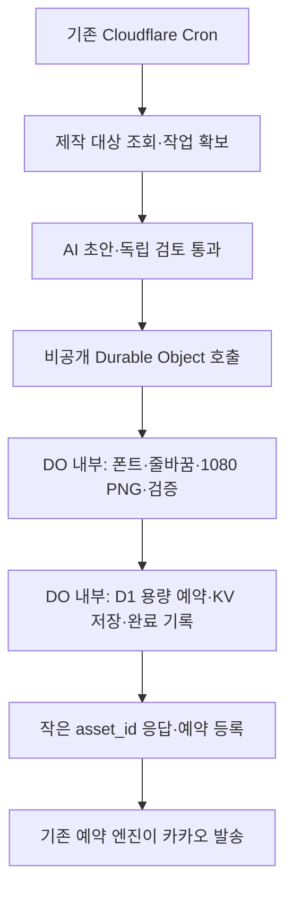

# 이미지 제작 실행 환경·구조 변경 조사

조사일: 2026-10-03 / Asia/Seoul. 공개된 공식 문서와 현재 저장소 코드를 대조했다. 이 문서는 **조사 결과와 제안**이며 구현·무료 계정 확인·원격 시험 완료 기록이 아니다.

후속 진행: 사용자 승인에 따라 DO 전체 이미지 경로를 구현하고 실제 Free에서1080 PNG20장을 검증했다. DO CPU78~474ms·일반 입구0~1ms이며 생성·회수 로그80/80을 확보했다. 전체 로그89/90의409 입구1건 누락과 제품 자동화 미구현은 별도로 남긴다. 임시 자원은 정리했다. 이 문서의 미검증 설명은 조사 당시 상태이며 최신 결과는 [DO 실측 보고서](AI_CARD_AUTOMATION_DURABLE.md)를 따른다.

**권고: SQLite 기반 Cloudflare Durable Objects에서 PNG 제작 전체를 실행하는 구조를 먼저 검증한다.** 일반 Worker의 10ms에 모든 이미지 계산을 맞추는 방식 외에 무료 실행 환경이 존재한다. Cloudflare의 Worker 제한 문서도 CPU 초과의 대응으로 Durable Objects에 계산을 옮기는 방법을 제시한다. [Workers 제한](https://developers.cloudflare.com/workers/platform/limits/)

현재 증거로 말할 수 있는 것은 ‘기존 일반 Worker 렌더러가 무료 CPU 기준을 충족하지 못했다’까지다. ‘무료·PC 종료 조건에서 더 이상 방법이 없다’는 결론은 근거보다 넓다.

## 1. 비교 결과

| 우선순위·후보 | 실행 환경과 공식 무료 조건 | 이 프로젝트에 적용하는 구조 | 남은 조건 |
| --- | --- | --- | --- |
| 1. Durable Objects | Free에서 SQLite 기반 DO 사용 가능. DO 전용 제한 문서는 요청당 기본 CPU 30초를 명시 | 기존 Cron → 비공개 DO에서 글자 준비·배치·PNG·검증·저장 → 기존 예약 발송 | Free 계정에서 전체 경로 실측, 폰트·Wasm 초기화/메모리, 허용 구성 확대 |
| 2. Browser Run | Free 브라우저 실행 시간 하루 10분. Quick Actions로 HTML/JS 화면을 PNG 촬영 | 클라우드 브라우저에서 기존 Canvas 함수 실행 → PNG 저장·예약 | 실제 브라우저 사용 시간, Worker 측 검증 CPU, 현재 금지 규칙 변경 |
| 3. Vercel Hobby Functions | 개인 비상업용 무료. Fluid Compute를 켠 Node.js 함수의 최대 경과 시간 300초 | Cloudflare가 인증된 Node 렌더러 호출 → 결과를 기존 저장 경로로 전달 | 별도 계정·배포·인증, 무료 공유 한도, PNG 수신/검증 CPU |
| 4. GitHub Actions | 표준 호스팅 러너는 공개 저장소 무료. 비공개 GitHub Free는 월 2,000분 포함 | Ubuntu 작업에서 사전 제작 → 인증된 업로드 → Cloudflare가 예약 시각에 발송 | 저장소·청구 조건, 대기/지연, 작업 인증·재전달, CI 사용 범위 변경 |

공식 근거: [DO 무료 요금](https://developers.cloudflare.com/durable-objects/platform/pricing/), [DO 실행 제한](https://developers.cloudflare.com/durable-objects/platform/limits/), [Browser Run 요금](https://developers.cloudflare.com/browser-run/pricing/), [스크린샷 API](https://developers.cloudflare.com/browser-run/quick-actions/screenshot-endpoint/), [Vercel 함수 제한](https://vercel.com/docs/functions/limitations), [Vercel Hobby](https://vercel.com/docs/plans/hobby), [GitHub Actions 요금](https://docs.github.com/en/billing/concepts/product-billing/github-actions).

30초는 DO의 **CPU 시간**, 300초는 Vercel 함수의 **전체 경과 시간**, 하루 10분은 Browser Run의 **누적 브라우저 사용 시간**이다. 서로 같은 측정값이나 카드 한 장의 예상 제작 시간이 아니다. 위 순위는 공식 문서와 기존 구조를 바탕으로 한 이 프로젝트의 설계 판단이다.

## 2. 우선 제안: 이미지 제작 전체를 DO로 이동

그림의 AI·자동 예약 연결은 미구현 계획이다. 이미지 실행 환경 변경이 AI 제작·교차 검토까지 완료시키지는 않는다.

현재 준비·수집·조립을 여러 일반 Worker 호출에 나누는 실험을 진행했지만 각 호출에 첫 실행 비용과 10ms 제약이 남았다. 제안은 계산을 더 잘게 나누는 대신, **렌더러의 실행 위치를 DO 요청 처리기로 바꾸는 것**이다. 일반 Worker에는 작은 입력 전달·결과 처리만 남기고 PNG 전체를 다시 파싱·압축하지 않게 한다.

DO는 같은 Cloudflare 계정에서 실행하고 기존 D1을 업무 상태의 기준, KV를 PNG 저장소로 유지한다. DO의 `env`에 구성된 바인딩을 사용할 수 있고, DO 안에서 KV를 읽고 쓰는 공식 예제도 있다. 따라서 PNG 바이트를 일반 Worker로 왕복시키지 않고 저장 후 식별자를 돌려주는 구조를 검증할 수 있다. [DO 환경 바인딩](https://developers.cloudflare.com/durable-objects/api/base/), [DO에서 KV 사용](https://developers.cloudflare.com/durable-objects/examples/use-kv-from-durable-objects/)

구현 시 재사용·변경 범위:

- `layoutCard`와 카드 스키마, 폰트·라이선스를 재사용한다. 조사 당시 `src/web/canvas.ts`에 있던 배치 계산은 2026-10-07 리팩토링에서 `src/shared/card-layout.ts`로 분리했다. DO에는 DOM/Canvas가 있다고 가정하지 않는다.
- `experiments/automation-png/svg.ts`, `raster.ts`의 SVG/Resvg 경로를 출발점으로 삼는다. 폰트 처리의 Worker 호환성과 전체 입력 경로는 별도 검증한다.
- 폰트 준비·Wasm 초기화·그리기·PNG 압축·`src/worker/png.ts` 검증을 DO 실행 경로에 둔다. 무거운 초기화를 일반 Worker의 최상위 초기화로 공유하지 않는다.
- `new_sqlite_classes`로 SQLite 기반 DO를 구성한다. 이 설정의 마이그레이션과 기존 D1 SQL 마이그레이션을 구별한다. [DO 시작 안내](https://developers.cloudflare.com/durable-objects/get-started/)
- 자동화별 고정 DO 이름과 D1 작업 ID/revision을 사용한다. `await` 사이의 재진입까지 직렬 실행된다고 가정하지 않고 D1 조건부 claim·중복 완료 방지를 유지한다.
- D1 용량 예약 → KV 저장 → asset ready의 순서와 실패 정리, 제작 마감·취소 확인을 유지한다. DO 추가가 D1·KV를 한 트랜잭션으로 묶어주지는 않는다.

원래 1080 PNG 시험의 실제 CPU는 35~258ms였다. 이는 30초보다 작아 DO를 검증할 이유가 되지만, **고정 SVG의 래스터화만 측정한 값**이다. 임의의 새 카드 내용·폰트·SVG 생성·저장까지 그 시간에 끝난다는 근거가 아니다. [기존 시험 범위와 결과](AI_CARD_AUTOMATION_FEASIBILITY.md)

Free DO는 요청 100,000회/일, 실행 시간 13,000 GB-s/일이 포함되고, 무료 한도 초과 시 해당 작업이 오류로 중단된다. 일일 한도는 UTC 자정에 초기화된다. 실행량은 DO가 활성 상태인 경과 시간과 할당 메모리 기준이므로 CPU 시간만으로 소비량을 계산하면 안 된다. 사용 후 종료 가능한 구조를 택하고 불필요한 타이머·연결을 유지하지 않는다. [DO 요금·초과 처리](https://developers.cloudflare.com/durable-objects/platform/pricing/)

## 3. 대안: 클라우드 브라우저에서 기존 Canvas 실행

Browser Run은 사용자의 PC 대신 Cloudflare가 브라우저를 실행한다. 기존 `renderCard`는 필요한 한글 폰트를 로드하고 `document.fonts.ready`를 기다린 뒤 1080×1080 Canvas를 만든다. 이 함수를 고정된 렌더링 페이지에서 호출하고 완료 표시가 나온 후 Canvas 영역만 촬영하는 구성이 가능하다. 실제 폰트·색·줄바꿈 일치는 결과 PNG로 확인해야 한다.

공식 Quick Actions는 `url` 또는 `html`을 받아 JavaScript 실행 결과를 촬영한다. `env.BROWSER.quickAction('screenshot', ...)` 바인딩을 쓰면 별도 Cloudflare API 토큰 없이 호출할 수 있다. 로컬 모의 실행은 지원하지 않아 실제 브라우저 호출은 원격 실행·사용량에 해당한다. [스크린샷](https://developers.cloudflare.com/browser-run/quick-actions/screenshot-endpoint/), [Quick Actions 바인딩](https://developers.cloudflare.com/browser-run/quick-actions/)

권장 연결은 ‘검증된 카드 JSON → 고정 페이지/고정 JS → 폰트·Canvas 완료 표시 → PNG’다. AI가 만든 HTML·JS를 실행하거나 임의 외부 URL을 촬영하는 API로 만들지 않는다. 1080 viewport와 배율 1, 완료 selector를 명시하고 버튼·앱 주변 화면을 제외한다. PNG가 일반 Worker로 돌아오면 검증·저장의 CPU는 여전히 측정해야 한다.

무료 브라우저 시간은 하루 600초이며 요청별 `X-Browser-Ms-Used`와 계정 전체 사용량으로 확인할 수 있다. 하루 한 장이어도 시작·폰트·재시도 비용을 측정하기 전에는 충분하다고 확정하지 않는다. 무료 일일 한도를 넘으면 다음 UTC 날짜까지 429 오류가 발생한다. [요금](https://developers.cloudflare.com/browser-run/pricing/), [사용량 헤더](https://developers.cloudflare.com/browser-run/quick-actions/), [초과 오류](https://developers.cloudflare.com/browser-run/limits/)

## 4. 별도 서비스에서 Node/브라우저 실행

**Vercel:** Hobby의 개인 비상업용 조건에 맞는 계정에서 Node.js 렌더러를 두고 Cloudflare가 호출한다. Fluid Compute 사용 시 함수 최대 경과 시간은 300초, 메모리는 2GB다. 폰트와 SVG/Resvg를 묶어 실행하는 방법은 설계 후보이며 배포 검증은 하지 않았다. Hobby 무료 한도 초과 시 서비스가 중단될 수 있다. [함수 제한](https://vercel.com/docs/functions/limitations), [Hobby 조건](https://vercel.com/docs/plans/hobby), [한도 초과](https://vercel.com/docs/plans)

Vercel 자체 Hobby Cron은 하루 한 번, 실행 시각도 해당 시간대 안에서 최대 59분 차이가 날 수 있다. 이 프로젝트에서는 Cloudflare가 사전 제작을 요청하고 기존 예약 엔진이 발송하도록 한다. 제작 결과는 job ID·revision·인증을 검증해 받아야 하며 D1/KV 자격 증명 전체를 외부 서비스에 넘기는 구성을 피한다. [Cron 제한](https://vercel.com/docs/cron-jobs/usage-and-pricing)

**GitHub Actions:** 표준 Ubuntu 러너에서 Node 또는 Playwright로 PNG를 만들어 인증된 업로드 경로로 전달한다. 비공개 GitHub Free의 월 2,000분은 다른 작업과 공유하며, 결제 수단이 있으면 초과 사용이 청구될 수 있다. 결제 수단이 없으면 포함량 소진 후 실행이 차단된다는 공식 조건을 확인했다. 저장소 공개 여부·사용 중 플랜·청구 설정은 이번에 확인하지 않았다. [과금·차단 조건](https://docs.github.com/en/billing/concepts/product-billing/github-actions)

Actions 예약 실행은 부하에 따라 지연·누락될 수 있고, 공개 저장소는 활동이 60일 없으면 예약이 비활성화된다. 따라서 발송 시각의 보장 수단으로 사용하지 않는다. 사전 제작 전용으로 쓰더라도 완료 기한·업로드 재전달·누락 감지가 필요하다. Cloudflare가 dispatch하는 방법은 별도 인증이 필요한 설계 후보이며 이번에 API 연결을 구현하지 않았다. [예약 실행 제약](https://docs.github.com/en/actions/reference/workflows-and-actions/events-that-trigger-workflows#schedule)

## 5. CPU 문제를 해결하지 않는 변경

- 일반 Worker의 HTTP를 Cron으로 바꾸기: Free CPU는 둘 다 10ms다. [Workers 제한](https://developers.cloudflare.com/workers/platform/limits/)
- Cloudflare Workflows로 옮기기만 하기: Free 요금표는 invocation당 CPU 10ms를 명시한다. 대기·재시도 관리와 렌더 계산 예산 확대를 혼동하지 않는다. [Workflows Free 요금](https://developers.cloudflare.com/workflows/reference/pricing/)
- 캐시만 추가하기: 새 내용의 첫 제작 비용이 남는다. 이번 목표는 매일 새로운 카드이므로 기존 PNG 재사용만으로 충족하지 못한다.
- 사용자의 브라우저에서 계속 제작하기: 현재 수동 기능에는 적합하지만 PC·브라우저 종료 상태의 신규 무인 제작을 충족하지 못한다.
- 800/720 해상도만 더 낮추기: 기존 실험에서 첫 실행·준비 비용이 남았다. 새 실행 환경의 첫 검증은 원래 1080으로 하고, 축소는 이후 파일 크기·가독성 선택으로 비교한다. [기존 실측](AI_CARD_AUTOMATION_DIAGNOSTIC.md)

## 6. 채택 전에 확인할 구체적 항목

1. **구성 범위:** 현재 [AGENTS.md](../AGENTS.md)의 비용 규칙은 Workers/D1/KV 중심이고 Browser Run을 명시적으로 금지한다. DO도 기존 허용 구성에 포함되지 않는다. 후보 채택 시 해당 범위와 `scripts/check-free.mjs`를 함께 갱신해야 한다. 이번 조사에서는 규칙·배포 설정을 바꾸지 않았다.
2. **DO 로컬 실험:** 고정 SVG 시험과 새 카드 JSON 전체 렌더를 구분한다. 표현형·비교형·긴 한영 문장·잘못된 입력으로 1080 PNG, 폰트·줄바꿈·상한·실패 정리를 확인한다. 기존 실험 코드를 재사용하되 임의 카드의 글자 준비까지 실행한다.
3. **Free 원격 실측:** 계정 플랜과 공유 사용량을 확인한 별도 시험 자원에서 최초/반복 실행을 구분해 잰다. 일반 호출 Worker의 CPU 10ms와 DO 문서의 기본 CPU 30초를 각각 확인한다. 정상 HTTP 응답만으로 판정하지 않고 CPU·outcome·경과 시간·PNG·버전 로그가 모두 있어야 한다. DO 한도 문서의 일반 Worker 한도 참조 문구도 있으므로 Free 계정의 실제 적용 상태를 시험 기록에 명시한다.
4. **저장 연결:** 임시 저장 자원으로 D1 예약·KV 실패·중복 호출·취소 경합을 검사한다. PNG 검증을 일반 Worker에 다시 떠넘겨 10ms 병목이 생기지 않는지 확인한다.
5. **완료 판정:** 두 템플릿 1080 PNG가 정상이고, 처음부터 끝까지 대상 런타임 한도 안에 있으며, 로그 누락·용량 누수·중복 asset 완료가 없어야 이미지 경로를 통과로 표시한다. 시험 수와 비용 범위를 정한 뒤 원격 배포를 진행하며, 실패하면 원인에 따라 Browser Run 후보를 선택한다.

**이번에 수행한 검증:** 공식 문서의 무료 조건·시간 단위·초과 처리 대조, 현재 `worker.ts`의 고정 SVG 시험 범위, `raster.ts`·`svg.ts`·Canvas·무료 검사 허용 목록 확인. 문서 변경만 수행했다. 새 코드 실행·계정 로그인·원격 배포·PNG 생성·AI 호출·카카오 발송은 수행하지 않았다.

현재 추가로 필요한 비밀값은 없다. 후보 채택 후 필요한 바인딩·설정 이름을 정하며 비밀값 자체를 문서나 대화에 기록하지 않는다. 이미지 환경이 통과해도 AI 제공사 무료 조건과 자동 제작·교차 검토·예약 연결은 별도 미완료 항목이다.

현재 존재하는 로컬 SVG/PNG 기준 실험은 `npm run bench:automation:png`, 일반 Worker 시험 빌드는 `npm run bench:automation:worker:dry-run`으로 재현한다. 이 명령들은 DO 검증 명령이 아니다. DO 전용 설정·실행·배포 명령은 아직 없으며 도입 구현 시 추가한다.
